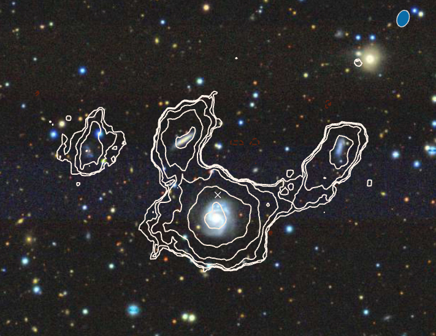

---

##### Download

+ [Paper](stae684.pdf)

---

##### Abstract

We report on the serendipitous discovery of 49 HI-rich galaxies in a 2.3 h Open Time observation with MeerKAT. We present their properties including their HI masses, intensity and velocity maps, and spectra. We determine that at least three HI-rich galaxy groups have been detected, potentially as part of a supergroup. Some members of these galaxy groups show clear interaction with each other in their HI emission. We cross-match the detections with PanSTARRS, Wide-field Infrared Survey Explorer, and Galaxy Evolution Explorer, and obtain stellar masses and star formation rates. One source is found to be a potential OH megamaser, but further follow-up is required to confidently determine this. For six sources with sufficient spatial resolution in HI, we produce rotation curves with BBarolo, generate mass models, and derive a dark matter halo mass. While the number of galaxies detected in this relatively short pointing appears to be at the high end of expectations compared to other MeerKAT observations and group HI mass function studies, this finding highlights the capability of MeerKAT for other serendipitous discoveries, and the potential for many more HI-rich galaxies to be revealed within both existing and upcoming Open Time data sets.

---

##### Figure 6: HI contours over DR10 image.



---

##### Citation

M Glowacki, L Albrow, T Reynolds, E Elson, E K Mahony, J R Allison, A serendipitous discovery of H i-rich galaxy groups with MeerKAT, Monthly Notices of the Royal Astronomical Society, Volume 529, Issue 4, April 2024, Pages 3469–3483, [https://doi.org/10.1093/mnras/stae684](https://doi.org/10.1093/mnras/stae684)

```BibTeX
@article{glowackiSerendipitousDiscoveryHIrich2024,
  title = {A Serendipitous Discovery of {{HI-rich}} Galaxy Groups with {{MeerKAT}}},
  author = {Glowacki, M. and Albrow, L. and Reynolds, T. and Elson, E. and Mahony, E. K. and Allison, J. R.},
  year = {2024},
  month = mar,
  journal = {Monthly Notices of the Royal Astronomical Society},
  eprint = {2403.16807},
  issn = {13652966},
  doi = {10.1093/mnras/stae684},
  copyright = {All rights reserved}
}
```
